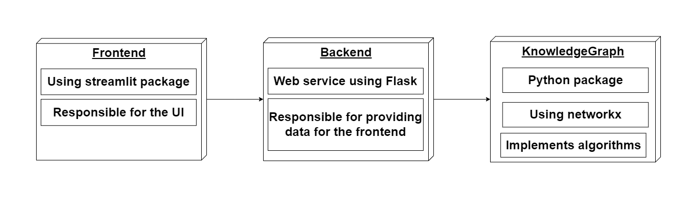
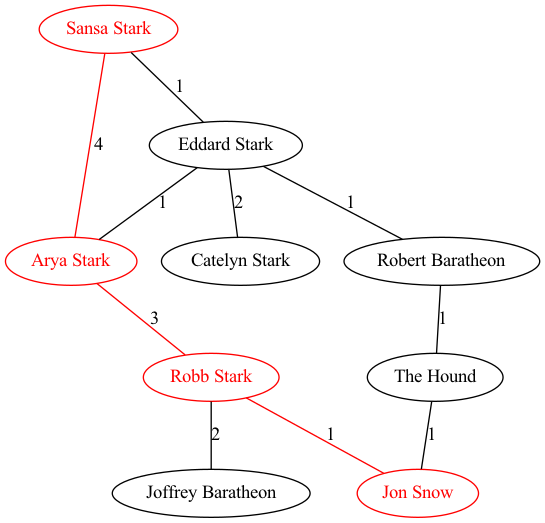

<p align="center">
    <h1>TUW Programming in Python 2022WS - Lecture/Exercise 5</h1>
  
</p>

- This repository contains the lecture and exercise material for the fifth lecture and exercise of the TUW Programming in Python course. 
- This lecture aims to introduce the concept of separating code into different modules and packages. 
- How to install and use a repository as a python package.
- During this lecture we will cover a basic data science task and how to properly structure your code:
    - We will use the book [a Song of Ice and Fire](https://awoiaf.westeros.org/index.php/A_Song_of_Ice_and_Fire) as our dataset
    - It is preprocessed so in the _data_ folder you will find it separated line by line
    - Our task is to find character mentions in the book, namely finding characters mentioned together in the same sentence
    - Then we will use the [NetworkX](https://networkx.org/) library to visualize the network of character mentions
    - We will also use the [Flask](https://flask.palletsprojects.com/en/2.0.x/) library to create a simple web application to serve the network through a REST API
    - We will also see a visualization library that can be used purely with python, namely [streamlit](https://streamlit.io/)
    - You will be able to see how easy it is to create a web interface for your data science project with streamlit
    - Unit tests are also included in the repository, you can run them with `python -m pytest`
- Our main idea with this exercise was to show how to implement a data science project in a structured way, not just only use jupyter notebooks. In this project we will only use jupyter for demonstration purposes.
- You will need a IDE to work on this project, you can use [PyCharm](https://www.jetbrains.com/pycharm/), [VSCode](https://code.visualstudio.com/) or even a simple [vim](https://www.vim.org/) setup (but you can use any other IDE you like).

## Install and Quick Start

First create a new conda environment with python 3.10 and activate it:

```bash
conda create -n pynlp python=3.10
conda activate pynlp
```

Then install this repository as a package:

```bash
pip install -e .
```

Also install the modified version of the `streamlit-agraph` package:
```bash
pip install https://github.com/adaamko/streamlit-agraph/releases/download/v0.0.43/streamlit_agraph-0.0.43-py3-none-any.whl
```

Install `black` library for code formatting:
```bash
pip install black
```

Install `pytest` library for code linting:
```bash
pip install pytest
```

If needed, install `jupyter`:
```bash
pip install ipykernel
pip install jupyter
```

## The architecture of the repository



Note how we separate the logic of the application from the visualization. It is good because this way:
- we can easily change the visualization without changing the logic
- we can easily change the logic without changing the visualization
- since we access the knowledge graph through the `KnowledgeGraph` class, we can easily change the knowledge graph without changing the logic or the visualization (e.g. use other graph library than networkx)
- we also access the knowledge graph through a web API, so we can easily deploy the application on a server and access the knowledge graph from a different machine
    - this is especially useful if we have some resource intensive tasks (e.g. training a model) that we want to run on a server, but the visualization is lightweight and can be run on a client machine

## The directory structure

```
📦pynlp-lecture-5
 ┣ 📂data
 ┃ ┣ 📜001ssb.txt
 ┃ ┣ 📜001ssb_line.txt
 ┃ ┣ 📜002ssb.txt
 ┃ ┣ 📜002ssb_line.txt
 ┃ ┣ 📜003ssb.txt
 ┃ ┣ 📜003ssb_line.txt
 ┃ ┣ 📜004ssb.txt
 ┃ ┣ 📜004ssb_line.txt
 ┃ ┣ 📜005ssb.txt
 ┃ ┣ 📜005ssb_line.txt
 ┃ ┣ 📜character_aliases.json
 ┃ ┣ 📜characters.txt
 ┃ ┗ 📜serialized_kg.json
 ┣ 📂examples
 ┃ ┣ 📜adam.jpg
 ┃ ┣ 📜flask_example.py
 ┃ ┣ 📜lecture.ipynb
 ┃ ┗ 📜streamlit_example.py
 ┣ 📂images
 ┃ ┗ 📜architecture.png
 ┣ 📂pynlp5
 ┃ ┣ 📜__init__.py
 ┃ ┣ 📜constants.py
 ┃ ┣ 📜knowledge_graph.py
 ┣ 📂scripts
 ┃ ┗ 📜process_data.py
 ┣ 📂services
 ┃ ┣ 📜backend.py
 ┃ ┣ 📜frontend.py
 ┃ ┗ 📜utils.py
 ┣ 📂tests
 ┃ ┣ 📜character_aliases_test.json
 ┃ ┣ 📜characters_test.txt
 ┃ ┣ 📜test_kg.py
 ┃ ┗ 📜test_lines.txt
 ┣ 📜.gitignore
 ┣ 📜LICENSE
 ┣ 📜README.md
 ┗ 📜setup.py
```

- The `data` folder contains the preprocessed and the raw data that we will use for this exercise. 
- The `examples` folder contains some examples of how to use the main libraries that we will use during the exercise (`streamlit`, `flask`, `networkx`, `re`). 
- The `pynlp5` folder contains the `KnowledgeGraph` class and the `constants.py` file, this is the main python package that serves as a backbone of our application. 
- The `scripts` folder contains the `process_data.py` script that we used to preprocess the data. 
- The `services` folder contains the `backend.py` and `frontend.py` files that creates the web application and uses the python package that we just created. 
- The `tests` folder contains the unit tests for the `KnowledgeGraph` class. 
- The `setup.py` file is used to install the repository as a python package (then it can be imported anywhere in the system as 'import pynlp5').

## How to run the infrastructure

### Start the Flask server

```bash
cd services
python backend.py
```

You can visit the API at http://localhost:5005 to make sure it is running (you can change the port in the `backend.py` file)


### Start the streamlit server

```bash
cd services
streamlit run frontend.py
```

Then visit http://localhost:8501 to see the streamlit application

Streamlit also can be run with a command line argument (to provide a parsed knowledge graph):
```bash
cd services
streamlit run frontend.py -- -kg ../data/serialized_kg.json
```


## Tasks

To complete this exercise and get the extra +15 point you are expected to complete two tasks:

### Task 1 (7 points)
#### Finding isolated characters in the knowledge graph
In this task you will need to find all the characters that are not connected to any other character in the knowledge graph. You can find the code for the `KnowledgeGraph` class in the `pynlp5/knowledge_graph.py` file.

You need to implement the `get_isolated_characters` function so that it returns a list of all the characters that are not connected to any other character in the knowledge graph. You can find the code for the `get_isolated_characters` function in the `pynlp5/knowledge_graph.py` file. 

This function has no arguments and should return a list of strings (character names) and the subgraph of the knowledge graph that contains only the isolated nodes. 

HINT: browse the algorithms in networkx: https://networkx.org/documentation/stable/reference/algorithms/index.html

### Task 2 (8 points)
#### Finding the shortest path between two characters in the knowledge graph

In this task you will need to find the shortest path between two characters in the knowledge graph. You can find the code for the `KnowledgeGraph` class in the `pynlp5/knowledge_graph.py` file.

You need to implement the `shortest_path_between_characters` function in the `pynlp5/knowledge_graph.py` file. This function should take two arguments: `character1` and `character2` and returns a the subgraph that only contains the edges that are part of the shortest path between the two characters and it also returns the sum of the weights of the edges in the shortest path (sum all the "weight" attributes of the edges in the shortest path).

An example for the shortest path between *"Sansa Stark"* and *"Jon Snow" *is shown below:



In this example you would need to return the following subgraph:


**And the sum of edges would be 8 (4 + 3 + 1).**

When calculating the shortest path you don't need to take the edge weights into account since then it would be a much harder problem. In our case it is enough to just find the shortest path in terms of the number of edges. You can think of a solution where you also try to maximize the sum of the weights of the edges and also minimize the number of edges, but that is not necessary for this exercise.

### Tests
If you completed the tasks correctly, you should be able to run the tests without errors with the following command:
```bash
python -m pytest
```
